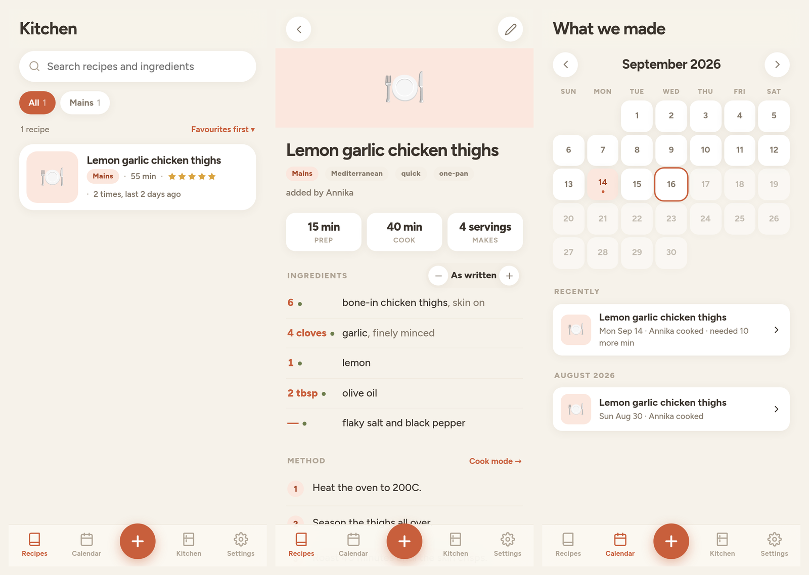

# Kitchen

A recipe box two people share. Screenshot a cookbook page, paste a link, send it
a TikTok — it reads the recipe and files it. Then it remembers what you made,
when, what you thought of it, and what you've got in the house.



Unlike the workouts and personal-assistant apps, this one has a server. It has
to: your phone and your partner's phone are looking at the same recipes, and
reading a screenshot or fetching a recipe site is something a browser can't do
on its own. It runs on Cloudflare's free tier — one command to deploy, nothing
to maintain, no credit card.

---

## What it does

**Four ways to add a recipe.** All four end in the same place: a filled-in form
you look at before it saves. An import is a good guess, not a fact, and the
moment to catch a missing oven temperature is before you're preheating.

| You have | It does |
| --- | --- |
| A photo or screenshot | Reads it — cookbook page, handwritten card, screenshot of a post. Several photos of one recipe are read together, in order. |
| A link to a recipe site | Takes the recipe exactly, usually without involving a model at all (see below). |
| A TikTok, Instagram or YouTube link | Reads the **caption**, not the video. Works when the creator wrote the recipe out; says so plainly when they didn't. |
| Text someone sent you | Paste it in. |
| Nothing but your memory | Type it in. Enter jumps to the next ingredient. |

**Cooking from it.** Scale a recipe up or down and every quantity follows,
rendered as fractions (`1½ cup`, not `1.5 cup`). Tick ingredients and steps off
as you go. Ingredients you already have get a green dot. **Cook mode** puts one
step on screen at big type, holds the screen awake, shows the ingredients for
*that* step, and swipes between them.

**Afterwards.** "We made this" logs the date. You each rate it separately, so
"she loved it, he didn't" survives. Notes are the things worth remembering —
*needed 10 more minutes*, *double the garlic*.

**The calendar.** A month grid of what got cooked when, a timeline under it, and
the totals: meals, how many in the last 30 days, what you make most, who cooked.

**The kitchen.** A list of what's in the fridge, freezer, cupboard and spice
rack, plus staples you never want to tick off. Feed it that and *What can I
make?* ranks every recipe by how much of it you already have — the ones you can
make tonight at the top, the ones you're two things short of below with the two
things named, because that's a shopping list, not a failure.

**Both phones, one box.** Anything either of you adds shows up for the other.
Opening the app refreshes it, and so does coming back to it after a while.

---

## Setting it up

About fifteen minutes, once. You need a free
[Cloudflare account](https://dash.cloudflare.com/sign-up) — no card, no plan.

### 1. Get the code and sign in

```bash
git clone https://github.com/annika-thomas/recipes.git kitchen
cd kitchen
npm install
npx wrangler login          # opens a browser to authorise
```

### 2. Make the database and the photo bucket

```bash
npx wrangler d1 create kitchen
npx wrangler r2 bucket create kitchen-photos
```

The first command prints a `database_id`. Open `wrangler.toml` and paste it over
`PASTE_YOUR_DATABASE_ID_HERE`. Then create the tables:

```bash
npm run db:init
```

### 3. Set the three secrets

These are stored by Cloudflare, never in the repo. Each command prompts for the
value.

```bash
npx wrangler secret put HOUSEHOLD_PASSCODE   # the passcode you'll both type
npx wrangler secret put SESSION_SECRET       # any long random string
npx wrangler secret put ANTHROPIC_API_KEY    # from console.anthropic.com
```

For `SESSION_SECRET`, `openssl rand -base64 32` gives you something suitable.
It only signs the login cookie — you never type it again.

`ANTHROPIC_API_KEY` is what reads screenshots and captions. It's a separate
thing from a Claude subscription: sign in at
[console.anthropic.com](https://console.anthropic.com), make a key, put a few
dollars of credit on it. See [what it costs](#what-it-costs) below.

**You can skip the API key.** Everything else works without it — typing recipes
in, and importing from recipe sites that publish structured data (which is most
of them). Add the key later and photo and reel importing lights up.

### 4. Deploy

```bash
npm run deploy
```

Wrangler prints a URL like `https://kitchen.<your-subdomain>.workers.dev`. That's
the app. Open it, type the passcode, put your name in.

Send the URL and the passcode to your partner and they do the same on their
phone with their own name.

### Keeping it to yourselves

The URL is public — anyone who has it gets the sign-in screen, and the passcode
is what stops them going further. Two things worth doing:

- Pick a passcode that isn't guessable in a few tries.
- The page is marked `noindex`, so it won't turn up in a search.

If you want a real wall in front of it, Cloudflare Access (free for up to 50
users) can sit on the Worker and require a login link to your email addresses
before the app even loads. Not necessary; available if you'd rather.

---

## Putting it on your home screen

This is the bit that makes it feel like an app rather than a website.

**On iPhone:** open the URL in **Safari** (it has to be Safari — Chrome on iOS
can't do this), tap the Share button, scroll down to **Add to Home Screen**,
name it *Kitchen*. It gets the icon, opens full screen with no address bar, and
remembers you're signed in.

**On Android:** open it in Chrome and tap **Install app** in the menu.

### Sharing a reel straight into it

The real workflow is: you're in Instagram, you see a recipe, you want it in the
box without retyping the URL. One Shortcut does that.

On your iPhone, open the **Shortcuts** app and build this:

1. **+** to make a new shortcut, then the **ⓘ** at the bottom → turn on **Show in
   Share Sheet**.
2. Under *Share Sheet Types*, leave only **URLs** ticked.
3. Add the action **Text**, and set its content to:
   ```
   https://kitchen.<your-subdomain>.workers.dev/?add=
   ```
   then tap at the end of that line and insert the **Shortcut Input** variable so
   it reads `…/?add=[Shortcut Input]`.
4. Add the action **Open URLs**, with the Text from step 3 as its input.
5. Name it **Save recipe** and save.

Now in TikTok or Instagram: Share → **Save recipe**. Kitchen opens with the
import already running.

You can do the same trick with the Share Sheet in Safari for recipe websites.

---

## How importing actually works

Worth knowing, because the three paths have genuinely different reliability and
the app is built to be honest about which one you're on.

### Recipe websites — very good

Nearly every food site on the internet publishes its recipes as
[schema.org/Recipe](https://schema.org/Recipe) structured data, because that's
how Google builds those recipe cards in search results. When the app finds it,
you get the recipe *exactly* — right quantities, right steps, right times — and
no model is involved at all, so it's instant and free.

When a site doesn't publish it, the page text gets read instead. Slower, costs a
fraction of a cent, still usually right.

Pages that build themselves entirely in JavaScript come back empty. The app says
so and suggests a screenshot.

### TikTok, Instagram, YouTube — depends on the caption

**This reads the caption, not the video.** Nothing is watching the footage or
transcribing the audio — that would mean downloading video the platforms don't
allow you to download, and it would cost real money per import.

That's less of a limitation than it sounds, because food creators put the
recipe in the caption *on purpose*, so people can save it. When they have, this
works well. When the recipe only exists in the voiceover or burned into the
video, the import comes back with the title, the link, and a note saying the
caption had no method — rather than inventing the parts it couldn't see.

Per platform:

- **TikTok** — uses TikTok's public oEmbed endpoint. Reliable.
- **YouTube** — reads the video description. Usually fine.
- **Instagram** — the shakiest of the three. Instagram actively discourages
  reading posts without being logged in and gets stricter over time. It works
  often enough to be worth trying, and fails with a clear message when it
  doesn't.

**When a reel doesn't come through, screenshot it.** Most recipe reels put the
steps on screen, and reading a screenshot is the path that always works.

### Photos — very good, and the universal fallback

Anything legible: a cookbook page, a recipe card in someone's handwriting, a
screenshot of a website, a screenshot of a reel. Up to six photos are read
together as one recipe, in order.

Photos are shrunk and re-encoded to JPEG in the browser before they're uploaded,
which keeps the cost down and quietly solves the HEIC problem (iPhones shoot
HEIC by default and the API can't read it).

---

## What it costs

Cloudflare's free tier covers this comfortably. D1 gives you 5GB and 5 million
row reads a day; R2 gives you 10GB of photos; Workers give you 100,000 requests
a day. Two people and a few thousand recipes will not come close.

The Anthropic API is the only thing that costs money, and only when a model is
actually involved:

| Import | Roughly |
| --- | --- |
| Recipe site that publishes structured data | **free** — no model call |
| A photo | 3–4¢ |
| A recipe site that needs reading | 3–5¢ |
| A reel caption | 2–3¢ |

That's with Claude Opus 5, which is the default because it reads bad
screenshots — angled cookbook pages, handwriting, low-contrast text on a video —
noticeably better than anything cheaper, and a wrong quantity is expensive in a
way three cents isn't. If you import constantly and would rather pay less, set
`CLAUDE_MODEL = "claude-sonnet-5"` in `wrangler.toml` and redeploy; that's about
2.5× cheaper and still good.

Twenty imports a month is well under a dollar either way.

---

## Where the data lives

One D1 database and one R2 bucket, both in your own Cloudflare account. Nothing
is shared with anyone else and there's no third party holding your recipes.

Photos and caption text are sent to the Anthropic API at the moment you import
something, in order to be read. Nothing else leaves — your ratings, notes and
cook log are only ever in your database.

**Settings → Download a backup** writes the whole library out as one JSON file.
Worth doing occasionally.

Deleting a recipe tombstones it rather than erasing it, so the calendar can still
tell you what you ate in March even if the recipe is long gone.

---

## Running it locally

```bash
npm run db:init:local     # creates a local SQLite copy of the schema
npm run dev               # http://127.0.0.1:8787
```

Local runs read secrets from a `.dev.vars` file (git-ignored):

```
HOUSEHOLD_PASSCODE=whatever
SESSION_SECRET=whatever
ANTHROPIC_API_KEY=sk-ant-...
```

`npm test` runs the import tests — the JSON-LD extractor against the shapes real
recipe sites actually emit, the ingredient matcher, and the normalisation that
sits between an import and the database. Those are the parts that rot quietly,
because when they break you get a recipe with no steps rather than an error.

---

## How it's put together

```
worker/                 the server: one Cloudflare Worker
  index.js              routing
  lib/auth.js           passcode in, signed cookie out
  lib/claude.js         the one place that talks to a model
  lib/recipeSchema.js   what a recipe is; every write goes through here
  extract/jsonld.js     schema.org/Recipe out of a page — the free path
  extract/page.js       fetching and de-cluttering a web page
  extract/social.js     TikTok / Instagram / YouTube captions
  routes/               recipes, cooks, ratings, notes, pantry, imports, images

public/                 the app: a static PWA, no build step
  js/store.js           all server traffic and all client state
  js/ui/                one file per screen
  js/util/match.js      ingredient matching — imported by BOTH halves, so the
                        app and the server can never disagree about what you have

schema.sql              the database
test/                   the import tests
```

There's no framework and no build step. The Worker bundles through Wrangler;
the browser loads the ES modules directly.
